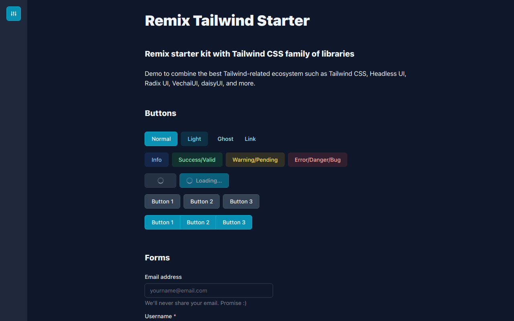

# Remix Tailwind Starter Kit

Remix starter kit with Tailwind CSS v3 family of libraries.

Example demo to combine the best Tailwind-related ecosystem such as Tailwind
CSS, Headless UI, Radix UI, Vechai UI, and more.

Features:

- Remix as the React framework
- Tailwind CSS using Vechai UI as primary components
- Theme switcher and persist theme with a session cookie

Preview: [remix-tailwind-starter-kit.vercel.app](https://remix-tailwind-starter-kit.vercel.app)



## Stacks

- Core
  - React v17
  - Remix v1
  - TypeScript v4
- Frontend
  - Tailwind CSS v3
  - PostCSS v8
  - Heroicons v1
  - Headless UI v1 — Unstyled accessible UI components
  - Radix UI v0 — Unstyled accessible UI components
  - Vechai UI v0 — React Tailwind CSS components
  - HyperUI — Collection of free Tailwind CSS components
  - LaLoka Layouts — Useful layouts for Tailwind CSS
  - Flowbite v1 — Tailwind CSS components
  - daisyUI v2 — Tailwind CSS components
  - NProgress
- Config
  - ESLint v8
  - Prettier v2
- Utility
  - clsx
- Deployment
  - Vercel

## Development

To run your Remix app locally, make sure your project's local dependencies are installed:

```sh
npm install
```

Copy the `.env.example` into `.env`:

```sh
cp .env.example .env
```

Setup the environment variables here and Vercel if want to deploy there:

```
SESSION_SECRET=type_the_secret_here
```

Afterwards, start the Remix development server like so:

```sh
npm run dev
```

Open up [http://localhost:3000](http://localhost:3000) and you should be ready to go!

If you're used to using the `vercel dev` command provided by [Vercel CLI](https://vercel.com/cli) instead, you can also use that, but it's not needed.

## Build

Make sure that it can build just fine:

```sh
npm run build
```

## Deployment

After having run the `create-remix` command and selected "Vercel" as a deployment target, you only need to [import your Git repository](https://vercel.com/new) into Vercel, and it will be deployed.

If you'd like to avoid using a Git repository, you can also deploy the directory by running [Vercel CLI](https://vercel.com/cli):

```sh
npm i -g vercel
vercel
```

It is generally recommended to use a Git repository, because future commits will then automatically be deployed by Vercel, through its [Git Integration](https://vercel.com/docs/concepts/git).

## Notes

### Vechai UI

Edit `tailwind.config.js` to remove custom colors to reduce the stylesheet build size.
`cssBase` is still required to get the default Tailwind CSS colors into Vechai UI themes.

```diff
module.exports = {
  // ...
  theme: {
    extend: {
      colors: {
-       info: colors.blue,
-       success: colors.green,
-       warning: colors.yellow,
-       error: colors.red,
      },
    },
  },
  plugins: [
    // ...
   require('@vechaiui/core')({
     cssBase: true,
-    colors: ['info', 'success', 'warning', 'error'],
   }),
  ],
};
```
