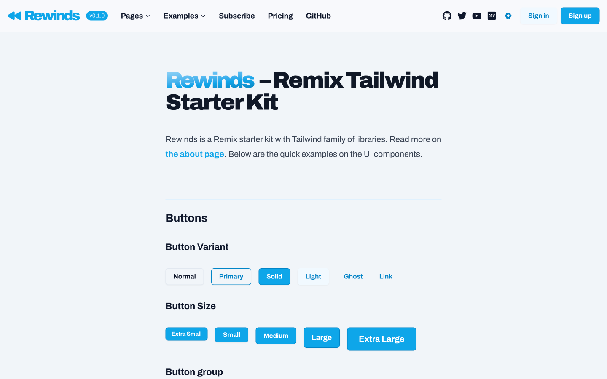
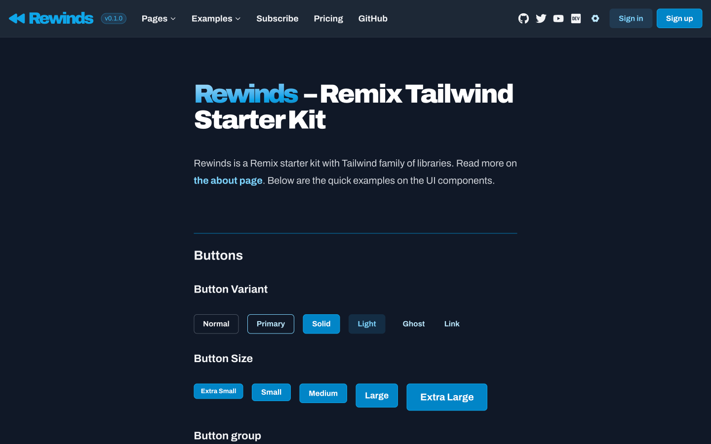

# ⏪ Rewinds — Remix Tailwind Starter Kit


Rewinds is a Remix starter kit with Tailwind CSS v3 family of libraries. This is an example demo to combine the best Tailwind-related ecosystem such as Tailwind CSS, Headless UI, Radix UI, Reach UI, Vechai UI, and more. Using TypeScript too!

Visit the live demo and repo:

- [rewinds.mhaidarhanif.com](https://rewinds.mhaidarhanif.com)
- [rewinds.vercel.app](https://rewinds.vercel.app)
- [mhaidarhanif/rewinds](https://github.com/mhaidarhanif/rewinds)

You can deploy this yourself. Just remember to [setup the environment variables](#environment-variables) on Vercel. Depending on your configuration, the app might need GraphCMS.

[](https://vercel.com/new/clone?repository-url=https://github.com/mhaidarhanif/rewinds/tree/main)
[](https://app.graphcms.com/clone/573c72908a25476eaf3373c7fe105233)

## Screenshots

> ⚠️ The repo is ongoing active development so a lot of things might change quickly.

<div style="max-width: 720px;">

[](https://rewinds.mhaidarhanif.com)

[](https://rewinds.mhaidarhanif.com)

</div>

## What's inside

More into what we can do or what you get. The complete features are listed in [the about page](https://rewinds.mhaidarhanif.com/about). While the complete examples are listed in [the examples page](https://rewinds.mhaidarhanif.com/examples).

- [x] Remix as the web framework
- [x] React as the UI library
- [x] TypeScript as the programming language
- [x] Tailwind CSS using Vechai UI as the base components
- [x] Multiple themes switcher and persist theme with a session cookie
  - [ ] Not yet with system theme auto detect
- [x] Commonly used pages/routes with contents
- [x] Ready to use components that highly customizable
- [x] Form submission with either Remix Form or React Hook Form
- [x] Data fetching with REST API or GraphQL
- [x] Nested routes use cases
- [ ] Optimistic UI on form submit
- [ ] Storybook for components development
- [x] Only focus on the frontend styling and project structure, without particular in testing and database
  - Just a bit of backend integration through Remix loader
  - For the full stack integration with database and testing, check out the official Remix Stacks instead: https://remix.run/stacks

## Stacks

More into what is being used. The complete stacks are listed in [the about page](https://rewinds.mhaidarhanif.com/about).

- [x] TypeScript v4.6
  - [x] Type checking is enforced
- [x] Node.js v14-v17
- [x] npm v8
  - Not Yarn because v1 & v2 difference
- [x] React v17
- [x] Remix v1.5
- [x] Tailwind CSS v3
- [x] PostCSS v8
- [x] Fonts
  - Google Fonts
  - Fontbit CDN
- [x] Icons
  - React Icons
  - Heroicons v1
  - Font Awesome
  - Phospor Icons
- [x] Styled the headless unstyled components
  - [x] Headless UI v1 — Unstyled accessible UI components
  - [x] Radix UI v0 — Unstyled accessible UI components
    - Tailwind Radix
  - [x] Reach UI v0 — Unstyled accessible UI components
  - [x] Vechai UI v0 — React Tailwind CSS components
  - [ ] Downshift — Primitives to build simple, flexible, WAI-ARIA compliant React autocomplete/combobox or select dropdown components
  - [ ] React Aria v3 — Library of React Hooks that provides accessible UI primitives for your design system
  - [ ] Ariakit (v2) — Toolkit for building accessible web apps with React
    - [ ] Reakit (v1) — Toolkit for building accessible UIs
- [x] NProgress — Navigation progress
- [x] React Hook Form — Complex client side form handling
- [x] React Lazyload
- [x] Markdoc for Markdown parser
  - [x] For other RichText, can also use RichText from GraphCMS
  - [ ] Can also use Marked
- [x] Prism.js for code syntax highlighting
- [x] CSS classname utility with `clsx` or `cx` aliased as `classx`
- [x] GraphQL query/mutate with `graphql-request` and `urql`
- [x] REST API request with `fetch` and `axios`
- [ ] Internationalization with i18next
- [x] ESLint v8
  - [x] `eslint-config-airbnb`
  - [x] `eslint-config-prettier`
- [x] Stylelint v14
- [x] Prettier v2
  - [x] `prettier-plugin-tailwindcss`
- [x] Git hooks with Husky to lint staged files
  - eslint, stylelint, prettier, typecheck
- [x] Deployment to Vercel

> ⚠️ Make sure to not using React v18 yet as there's an issue with Tailwind CSS and Vechai UI.

## Development

### Clone repo

Click [Use this template button](https://github.com/mhaidarhanif/rewinds/generate).

```
git clone https://github.com/mhaidarhanif/rewinds rewinds-project
```

```
npx degit https://github.com/mhaidarhanif/rewinds rewinds-project
```

### Install dependencies

To run your Remix app locally, make sure your project's local dependencies are installed:

```sh
npm install
```

### Environment variables

Copy the `.env.example` into `.env`:

```sh
cp .env.example .env
# Edit .env as you prefer
```

> ⚠️ Make sure to setup the environment variables here, on Vercel, or on your preferred deployment target. Otherwise the app will break.

If you don't need some of these, you can remove them in the `.env`, `app/utils/env.server.ts`, and all `getEnvServer()` function calls.

Afterwards, run the Remix development server with the `dev` script. This will watch and compile for both the Tailwind styles and Remix app.

```sh
npm run dev
```

You can also use the `d` script for a quick way. This will compile Tailwind styles once and only watch the Remix app changes.

```sh
npm run d
```

Finally, open up [http://localhost:3000](http://localhost:3000) and you should be ready to go!

Note if you're used to using the `vercel dev` command provided by [Vercel CLI](https://vercel.com/cli) instead, you can also use that, but it's not needed. Although it can help with the Environment variables setup (no need to use `.env` file).

> ℹ️ Depending on your computer processing power, the first Tailwind compilation might take around ~3 seconds. Although Tailwind CSS v3 already has Just-in-Time engine enabled by default.

- https://tailwindcss.com/blog/just-in-time-the-next-generation-of-tailwind-css
- https://tailwindcss.com/docs/upgrade-guide#migrating-to-the-jit-engine

### Environment variables using Doppler

If you want to use [Doppler](https://doppler.com) to manage the environment variables, use the `dev:doppler` script. Therefore you won't need the `.env` file to be edited manually.

```sh
npm run dev:doppler
# doppler run -- npm run dev
```

### Project structure

Keep in mind that the structure is designed for scalability for medium-large project. If your project scope is too simple or too small, Rewinds might be a bit too much to handle.

- `.husky`
- `.vscode`
- `api`
- `app`
  - `components`: custom and aliased components
  - `configs`
  - `contents`
  - `data`
  - `features`
  - `graphql`
  - `hooks`
  - `layouts`
  - `libs`: Wrapper for `node_modules`
  - `routes`: Remix routes
  - `styles`
    - `out.css`: Tailwind output file
  - `types`
  - `utils`
  - `entry.client.tsx`
  - `entry.server.tsx`
  - `root.tsx`
  - `other-root-routes.server.ts`
- `public`
- `styles`
  - `global.css`: Tailwind input file
- `.gitignore`
- `package.json`
  - `.commitlintrc`
  - `.editorconfig`
  - `.eslintignore`
  - `.eslintrc`
  - `.lintstagedrc`
  - `.npmrc`
  - `.nvmrc`
  - `.prettierignore`
  - `.prettierrc`
  - `.stylelintrc`
  - `tsconfig.json`
  - `vercel.json`
- `README.md`
- `remix.config.js`
  - `.env`
  - `.env.example`
  - `postcss.config.js`
  - `tailwind.config.js`
  - `remix.env.d.ts`
  - `tsconfig.json`
- `server.js`

There are also some code you can customize with your own branding by editing all the things that commented with `EDITME` (Use Search in your editor) and other things like `site.webmanifest`.

Also when using this starter kit, you might want to remove most of the code in:

- `app`
  - `data`: custom data
  - `contents`: custom contents
  - `routes`: custom routes

Other than those you might want to keep them.

## Build

Make sure that it can build just fine:

```sh
npm run build
```

For more complementing the build:

```sh
npm run build
npm run lint
```

## Lint

Make sure to lint the code with both ESLint and Stylelint:

```sh
npm run lint
```

Or individually:

```sh
npm run eslint
npm run stylelint
npm run prettier
npm run typecheck
```

## Deployment

After having run the `create-remix` command and selected "Vercel" as a deployment target, you only need to [import your Git repository](https://vercel.com/new) into Vercel, and it will be deployed.

Or you can click the buttons in the introduction.

If you'd like to avoid using a Git repository, you can also deploy the directory by running [Vercel CLI](https://vercel.com/cli):

```sh
npm i -g vercel
vercel
```

It is generally recommended to use a Git repository, because future commits will then automatically be deployed by Vercel, through its [Git Integration](https://vercel.com/docs/concepts/git).

> ⚠️ Make sure to setup the environment variables in the project settings.

## Notes

### Remix

If you have older way of importing from `remix` package prior to `remix@1.4.3`, you can use the `migrate` script to change the import statements.

```sh
npx remix migrate --migration replace-remix-imports
```

Before:

```jsx
import { json, redirect } from "remix";
```

After:

```jsx
import { json, redirect } from "@remix-run/node";
```

### Vechai UI

Edit `tailwind.config.js` to remove custom colors to reduce the stylesheet build size. `cssBase` is still required to get the default Tailwind CSS colors into Vechai UI themes.

```diff
module.exports = {
  // ...
  theme: {
    extend: {
      colors: {
-       info: colors.blue,
-       success: colors.green,
-       warning: colors.yellow,
-       error: colors.red,
      },
    },
  },
  plugins: [
    // ...
   require('@vechaiui/core')({
     cssBase: true,
-    colors: ['info', 'success', 'warning', 'error'],
   }),
  ],
};
```

### ConvertKit

1. Sign up a new account on ConvertKit
2. Edit your profile information
3. Get the API Key to be used as `CONVERTKIT_API_KEY`
4. Create a Subscribe Form
5. Get the Form ID to be used as `CONVERTKIT_FORM_ID`

Tips:

- Setup the Mailing Address: https://help.convertkit.com/en/articles/2502494-alternatives-for-your-physical-address

### Other references

- [Bulletproof React - A simple, scalable, and powerful architecture for building production ready React applications](https://github.com/alan2207/bulletproof-react)
- [Why we use Tailwind CSS as our primary framework | Clean Commit](https://cleancommit.io/blog/why-we-use-tailwind-css-as-our-primary-framework)
- [An Honest Look at Tailwind as an API for CSS | thoughtbot, inc.](https://thoughtbot.com/blog/an-honest-look-at-tailwind-as-an-api-for-css)
- [Styling Best Practices I Use With Tailwind CSS | theodorusclarence.com](https://theodorusclarence.com/blog/tailwindcss-best-practice)
